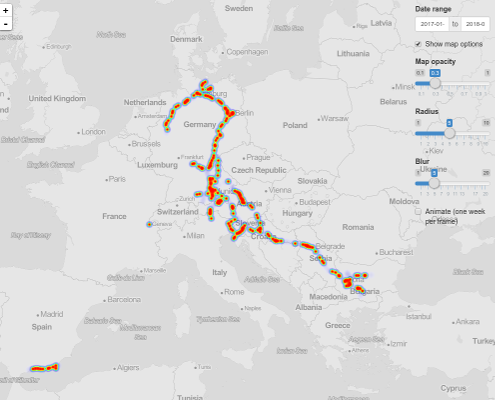

# google-location-heatmap
Takeout your google location history data and visualize it as a heatmap

### What is this
In case you have a mobile phone with location history enabled (and google maps on it), you should have quite a lot of location history data on google. This Shiny app takes your google location history, which you can download from your [google account](https://takeout.google.com/settings/takeout), and plots it as a heat trace on a map. You can interactively change some of the settings (map opacity, radius and blur of the heatmap) and select the time range you want to see.

### How to use
- First, go to [google takeout](https://takeout.google.com/settings/takeout), select "Location history" (and de-select all the rest), download and unzip the file. What you are going to need is the `LocationHistory.json` file. 
- In [RStudio](https://www.rstudio.com/), run

`runGitHub("google-location-heatmap", "angelovangel")`

If you don't have `shiny` installed, do it with `install.packages("shiny")` before doing the above. The app should open in a browser window on your computer. Note that the processing of your `json` file may take a while, depending on its size and the power of your machine.
- Of yourse, you can also manually download this repository, open the `app.R` file and press `Run App` in RStudio.

Cheers!   
Angel

PS The app checks if you have the required libraries and installs them if you don't. These are `shiny`, `shinyjs`, `tidyverse`, `leaflet.extras` and `lubridate`. 